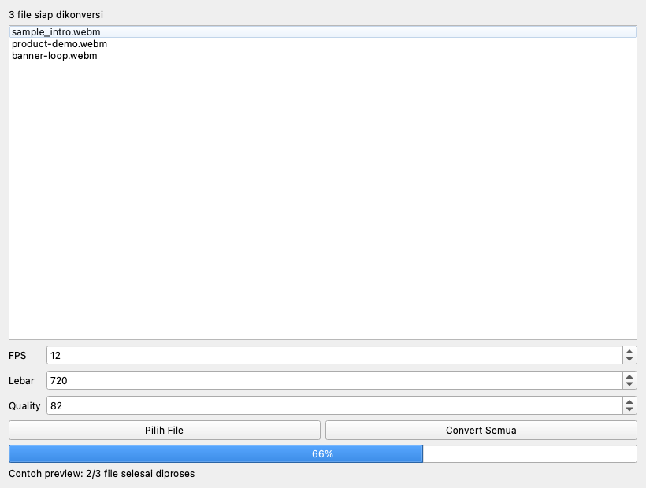

# webm2webp

Tool kecil berbasis Python untuk mengonversi file `.webm` menjadi animasi `.webp`.



Project ini mendukung:
- konversi satu atau banyak file sekaligus
- drag & drop banyak file di GUI
- pengaturan `FPS`, `Quality`, dan lebar output
- build menjadi aplikasi macOS `.app`
- workflow GitHub Release untuk artefak macOS

Riwayat perubahan versi tersedia di [CHANGELOG.md](CHANGELOG.md).

## Kebutuhan

Pastikan tools berikut tersedia:

- `ffmpeg`
- `img2webp`
- Python 3

Contoh install di macOS dengan Homebrew:

```bash
brew install ffmpeg webp
```

## Install

```bash
python3 -m venv venv
source venv/bin/activate
pip install -r requirements.txt
```

## Menjalankan GUI

```bash
python3 webm2webp_gui.py
```

Preview GUI di README ini digenerate dari aplikasi langsung dengan:

```bash
QT_QPA_PLATFORM=offscreen ./venv/bin/python scripts/render_gui_preview.py docs/gui-preview.png
```

Fitur GUI:
- pilih banyak file `.webm`
- drag & drop banyak file langsung ke jendela
- progress bar saat proses konversi
- pengaturan `FPS`, `Lebar`, dan `Quality`

## Menjalankan via CLI

```bash
python3 webm2webp.py file1.webm file2.webm
```

Contoh dengan pengaturan custom:

```bash
python3 webm2webp.py input.webm --fps 12 --scale 720 --quality 80
```

## Build App macOS

```bash
./build_macos_app.sh
```

Hasil build akan tersedia di:

```bash
dist/WebM2WebP.app
```

Script build akan:
- membuat icon app otomatis
- mengubah icon ke format `.icns`
- membangun `WebM2WebP.app` dengan PyInstaller

## Release Artefak dari GitHub

Repository ini sudah disiapkan dengan GitHub Actions untuk build artefak macOS otomatis saat Anda push tag versi.

Contoh:

```bash
git tag v1.0.0
git push origin v1.0.0
```

Setelah itu workflow GitHub akan:
- build `WebM2WebP.app`
- zip hasil build menjadi `WebM2WebP-macos.zip`
- upload file zip ke GitHub Release dengan tag yang sama

## Catatan

- Output `.webp` akan dibuat di folder yang sama dengan file input.
- Temporary frame disimpan di folder sementara agar aman untuk batch convert.
- Artefak build lebih aman disimpan di GitHub Releases daripada commit hasil build langsung ke repository.
